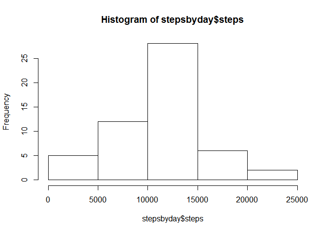
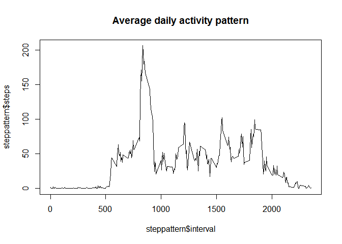
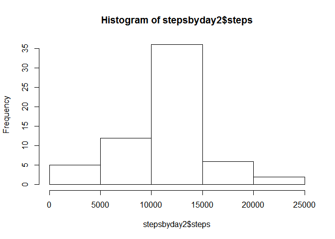
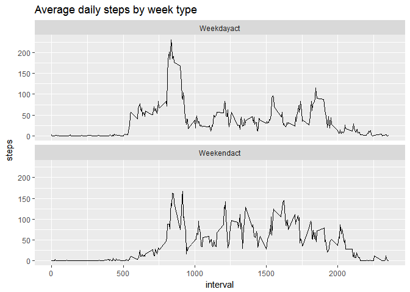

What is the mean total number of steps taken per day?

Load and read dataset

``` r
##unzipped file in working directory. Made wd the folder. 
act<- read.csv("activity.csv")
head(act)
```

    ##   steps       date interval
    ## 1    NA 2012-10-01        0
    ## 2    NA 2012-10-01        5
    ## 3    NA 2012-10-01       10
    ## 4    NA 2012-10-01       15
    ## 5    NA 2012-10-01       20
    ## 6    NA 2012-10-01       25

``` r
stepsbyday<-aggregate(steps~date, act, sum)
```

Create histogram of steps taken per day

``` r
hist(stepsbyday$steps)
```

 Calculate mean and median steps taken per day

``` r
meansteps<-mean(stepsbyday$steps)
mediansteps<-median(stepsbyday$steps)
```

What is the average daily activity pattern?

``` r
steppattern<-aggregate(steps~interval, act, mean)
plot2<-plot(steppattern$interval, steppattern$steps, type ="l", main="Average daily activity pattern")
```



``` r
print(plot2)
```

    ## NULL

Which 5 minute interval has max number of steps?

``` r
which.max(steppattern$steps)
```

    ## [1] 104

Imputting missing values

``` r
##calculate total missing values
sum(is.na(act$steps))
```

    ## [1] 2304

create new data set with missing values filled in
-------------------------------------------------

``` r
act2<-act
missval<-is.na(act2$steps)
actinterval<-tapply(act2$steps, act2$interval, mean, na.rm=TRUE) ##used mean to fill
act2$steps[missval]<-actinterval[as.character(act2$interval[missval])]
head(act2)
```

    ##       steps       date interval
    ## 1 1.7169811 2012-10-01        0
    ## 2 0.3396226 2012-10-01        5
    ## 3 0.1320755 2012-10-01       10
    ## 4 0.1509434 2012-10-01       15
    ## 5 0.0754717 2012-10-01       20
    ## 6 2.0943396 2012-10-01       25

make histogram and compute mean and median
------------------------------------------

``` r
stepsbyday2<-aggregate(steps~date, act2, sum)
plot3<-hist(stepsbyday2$steps)
```



``` r
print(plot3)
```

    ## $breaks
    ## [1]     0  5000 10000 15000 20000 25000
    ## 
    ## $counts
    ## [1]  5 12 36  6  2
    ## 
    ## $density
    ## [1] 1.639344e-05 3.934426e-05 1.180328e-04 1.967213e-05 6.557377e-06
    ## 
    ## $mids
    ## [1]  2500  7500 12500 17500 22500
    ## 
    ## $xname
    ## [1] "stepsbyday2$steps"
    ## 
    ## $equidist
    ## [1] TRUE
    ## 
    ## attr(,"class")
    ## [1] "histogram"

``` r
meansteps2<-mean(stepsbyday2$steps)
mediansteps2<-median(stepsbyday2$steps)
## > meansteps2
##[1] 10766.19
##> mediansteps2
##[1] 10766.19
## mean and median steps are lower than previous pre-imputed dataset
```

Are there differences in activity patterns between weekdays and weekends?

``` r
weekdayact<-c("Monday","Tuesday","Wednesday","Thursday","Friday")
weekendact<-c("Saturday","Sunday")
act2$week<-ifelse(is.element(weekdays(as.Date(act2$date))
                     ,weekdayact), "Weekdayact", "Weekendact")
act3<-aggregate(steps~interval+week,act2, mean)
head(act3)
```

    ##   interval       week      steps
    ## 1        0 Weekdayact 2.25115304
    ## 2        5 Weekdayact 0.44528302
    ## 3       10 Weekdayact 0.17316562
    ## 4       15 Weekdayact 0.19790356
    ## 5       20 Weekdayact 0.09895178
    ## 6       25 Weekdayact 1.59035639

Plot

``` r
library(ggplot2)
weekplot<-ggplot(act3, aes(interval, steps,fill=week))+
  geom_line()+
  facet_wrap(~week,nrow=2)+ ggtitle("Average daily steps by week type")
print(weekplot)
```


